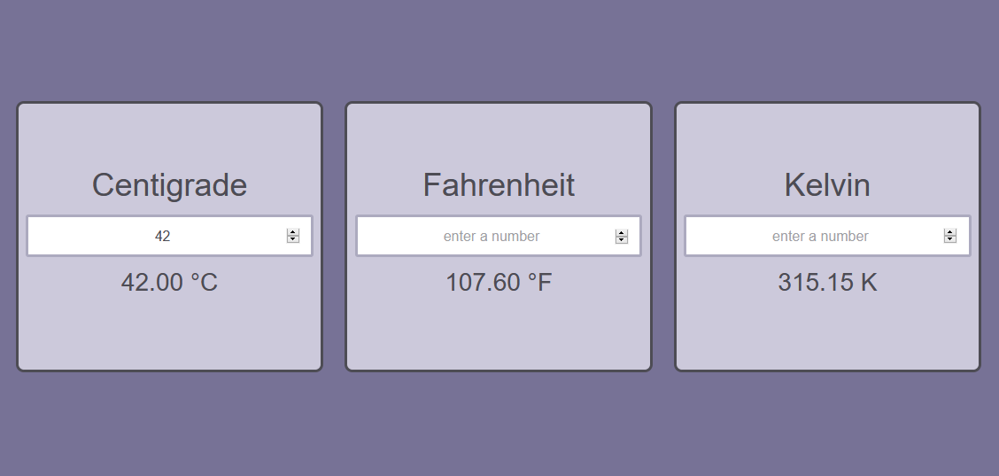

# Temperature Converter
###### Simple Celsius-Fahrenheit-Kelvin conversion tool using Javascript

This beginner project was created to learn about using simple conversion calculations in Javascript, as well as basic DOM manipulation. It was also my first exposure to using media queries to improve rendering on smaller screen sizes.

